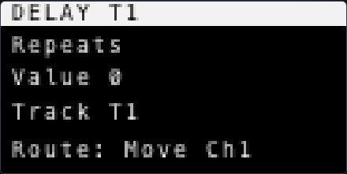

# Overture Beginner Guide

<!-- Generated by `pnpm -C web manual:generate`. Edit web/tests/manual/scenarios.ts (walkthrough) and content.ts (intro, cheat-sheet, glossary). -->

This guide is a screenshot-driven introduction to Overture's current UI. It is intentionally shorter than the inherited dAVEBOx manual — learn the main surfaces here first, then dive into the references below.

Each screenshot is produced by the real Overture UI running in the browser emulator, so it always reflects the current build. A cyan outline with a numbered badge marks each control you press for the action, and the numbers match the legend on the action banner. Coloured button fills are Overture's own live LED state.

**Where to go deeper:** [Overture vs dAVEBOx](../OVERTURE-VS-DAVEBOX.md) — what this fork changes, and why

## Contents

- [Controls cheat-sheet](#controls-cheat-sheet)
- [Orientation](#orientation)
- [The Two Main Views](#the-two-main-views)
- [Make a First Drum Pattern](#make-a-first-drum-pattern)
- [Move Between Clips and Editing](#move-between-clips-and-editing)
- [Select Tracks](#select-tracks)
- [Edit Parameters](#edit-parameters)
- [Save and Export Entry Points](#save-and-export-entry-points)
- [Glossary](#glossary)

## Controls cheat-sheet

| Control | Gesture | What it does |
| --- | --- | --- |
| Note/Session | Tap | Toggle Track View and Session View |
| Side buttons 1-4 | Tap (Track View) | Select track 1-4 — hold Shift for 5-8 |
| Pads | Tap | Play notes, or pick a drum lane on drum tracks |
| Step 1-16 | Tap | Place or clear a hit on the active lane |
| Jog wheel | Turn | Move through parameter banks |
| K1-K8 | Turn | Edit the eight values in the visible bank |
| Shift + Note/Session | Hold + tap | Open the Global Menu (save, load, export) |

## Orientation

The emulator mirrors the Move control surface: OLED on the left, encoders across the top, a 4x8 pad grid, four side buttons, and sixteen step buttons along the bottom.

The OLED is always the source of truth: it names the current mode, track, and parameter bank.

### The Overture surface

Start here: the OLED tells you the current mode and parameter bank. The yellow Loop LED is Overture's live Session Performance latch indicator, not a pressed-control marker.

### Reading the OLED

The OLED up close. It always names the current mode, the track or pad in focus, and the active parameter bank — the full-panel shots show it small, so refer back here.

## The Two Main Views

Overture alternates between Track View for editing one clip in detail and Session View for launching or arranging clips across tracks.

Tap Note/Session on the hardware to switch views. These screenshots drive that real view-toggle path, then wait for the emulator to settle before capture.

### Track View

Track View is the detailed editor: pads play notes or drum lanes, steps edit the active clip, and encoders edit the current parameter bank.

### Session View

Session View is the clip launcher: the pad grid represents clips across tracks and scene rows.

## Make a First Drum Pattern

On a drum track, the left side of the pad grid selects drum lanes. Once a lane is active, the sixteen step buttons place hits for that lane.

This is the fastest path to making Overture feel concrete: choose a lane, add a few steps, then press Play on the device.

### A simple lane pattern

The lit step buttons show hits placed on the active drum lane. The OLED remains the source of truth for the current track, bank, and edit context.

## Move Between Clips and Editing

Use Session View to focus or launch clips, then return to Track View when you want to edit the selected clip's notes and parameters.

This split is central to Overture: arrangement lives in Session View; detailed editing lives in Track View.

### Focus a clip in Session View

The highlighted bottom-row clip pad selects scene D on track 1, which is why the OLED changes the track-1 scene letter to D.

### Return to detailed editing

Back in Track View, the step row and parameter bank apply to the focused clip.

## Select Tracks

In Overture's Track View, the four side buttons select tracks 1-4. Hold Shift with a side button to reach tracks 5-8.

This is one of Overture's Move-native changes from dAVEBOx: side buttons are track identity first, not clip buttons.

### Side buttons select tracks

The active side-button LED shows the selected track. Other side buttons stay dim in their track colors.

### Shift reaches the upper track bank

Hold Shift while selecting a side button to address tracks 5-8.

## Edit Parameters

Turn the jog wheel to move through parameter banks. Turn K1-K8 to change values in the visible bank.

Most values are clip-specific, so switching clips can change what the same controls do and what values they show.

### Parameter bank editing

The OLED shows the active bank and the eight encoder rows. Touching or turning an encoder updates the corresponding value.

### The bank readout up close

The OLED row order matches K1-K8 left to right. The close-up makes the active bank and its eight values legible.

## Save and Export Entry Points

The Global Menu contains track configuration plus project-level actions. Open it with Shift + Note/Session, rotate the jog to move, and press the jog to edit or confirm.

This v1 guide only shows the entry points. It does not execute destructive or file-producing actions such as clearing a session or exporting.

### Open the Global Menu

Shift + Note/Session opens the menu. The first pages are usually focused on the active track.

### Scroll to project actions

Rotate the jog to reach additional actions such as save, load, export, and global settings.

## Glossary

| Term | Meaning |
| --- | --- |
| Track View | The detailed editor for one clip: pads, steps, jog, and encoders. |
| Session View | The clip launcher: the pad grid is clips across tracks and scene rows. |
| Scene | A row of clips — one per track — launched together (A, B, C ...). |
| Parameter bank | A page of eight encoder (K1-K8) parameters shown on the OLED. |
| Drum lane | One drum voice on a drum track; its 16 steps are edited on the step row. |

---

[Overture vs dAVEBOx](../OVERTURE-VS-DAVEBOX.md) — what this fork changes, and why
