# Overture Beginner Guide

<!-- Generated by `pnpm -C web manual:generate`. Edit web/tests/manual-shots.spec.ts for scenarios and curated text. -->

This guide is a screenshot-driven introduction to Overture's current UI. It is intentionally shorter than the inherited dAVEBOx manual: use it to learn the main surfaces first, then consult `overture-ui/MANUAL.md` for the full reference.

## Orientation

The emulator mirrors the Move control surface: OLED on the left, encoders across the top, a 4x8 pad grid, four side buttons, and sixteen step buttons along the bottom.

Treat the screenshots as executable documentation: each one is produced by the real Overture UI running in the browser emulator.

### The Overture surface

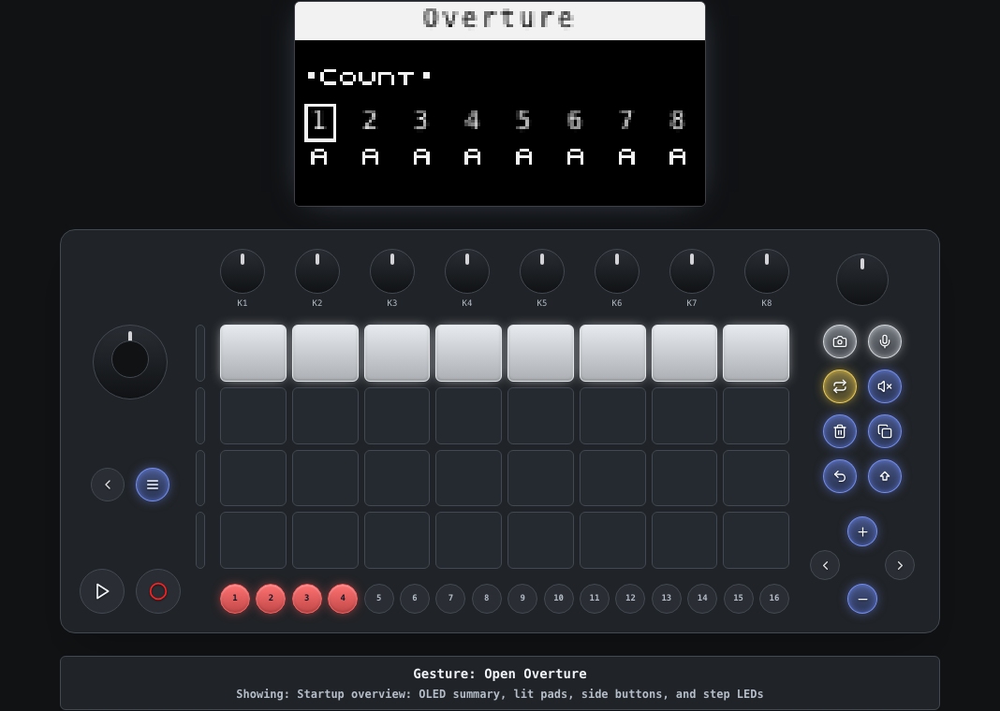

Start here: the OLED tells you the current mode and parameter bank; pads, steps, side buttons, jog, and encoders drive the same MIDI entry points as the hardware.

## The Two Main Views

Overture alternates between Track View for editing one clip in detail and Session View for launching or arranging clips across tracks.

Tap Note/Session on the hardware to switch views. These screenshots drive that real view-toggle path, then wait for the emulator to settle before capture.

### Track View

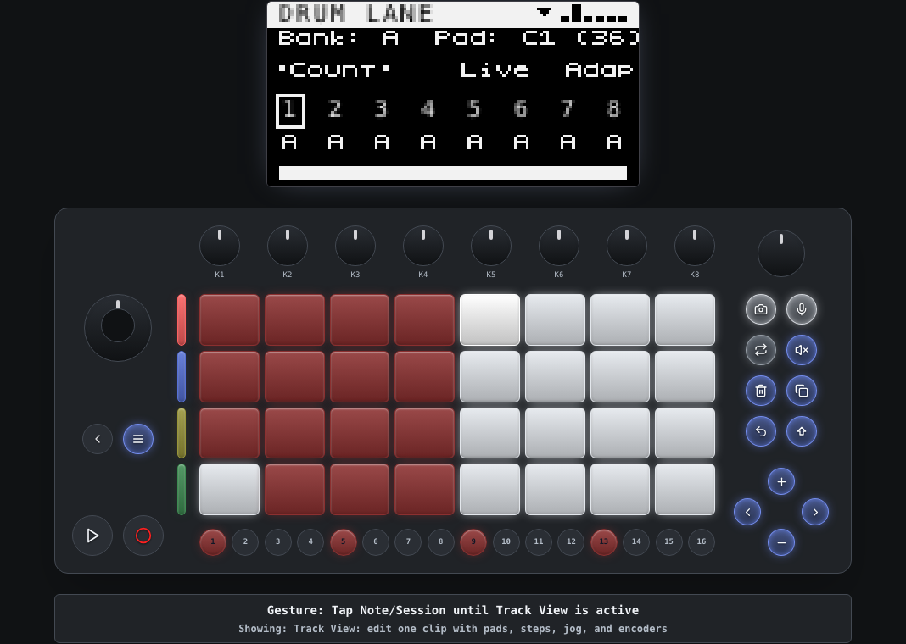

Track View is the detailed editor: pads play notes or drum lanes, steps edit the active clip, and encoders edit the current parameter bank.

### Session View

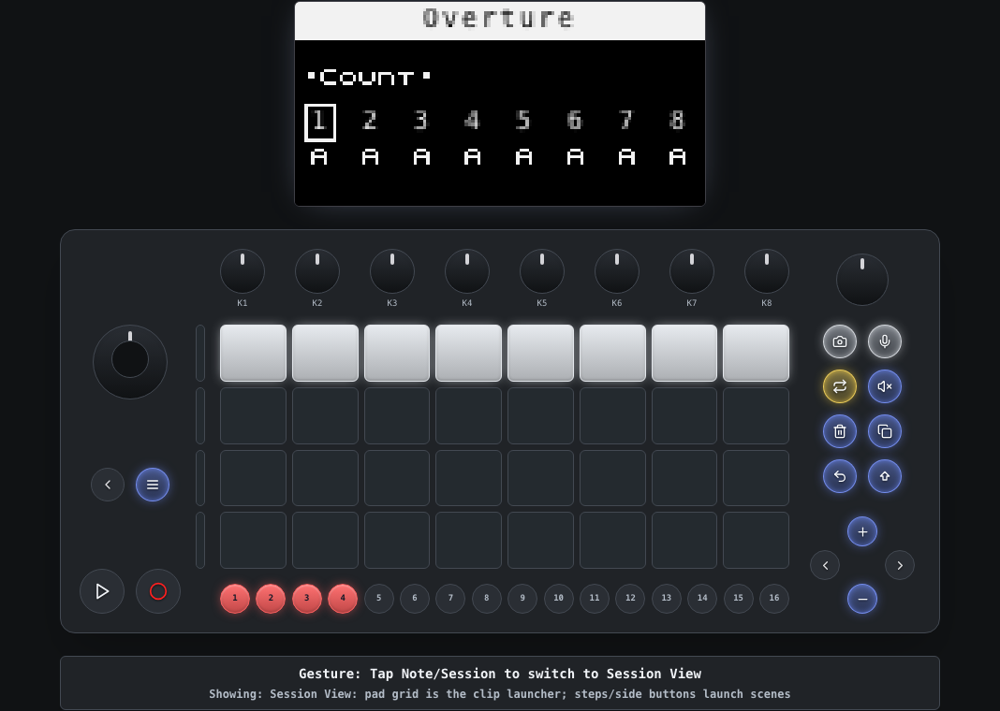

Session View is the clip launcher: the pad grid represents clips across tracks and scene rows.

## Make a First Drum Pattern

On a drum track, the left side of the pad grid selects drum lanes. Once a lane is active, the sixteen step buttons place hits for that lane.

This is the fastest path to making Overture feel concrete: choose a lane, add a few steps, then press Play on the device.

### A simple lane pattern

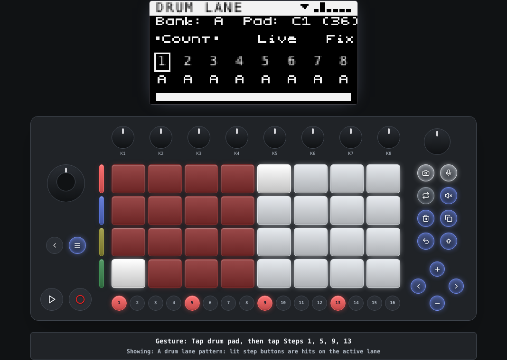

The lit step buttons show hits placed on the active drum lane. The OLED remains the source of truth for the current track, bank, and edit context.

## Move Between Clips and Editing

Use Session View to focus or launch clips, then return to Track View when you want to edit the selected clip's notes and parameters.

This split is central to Overture: arrangement lives in Session View; detailed editing lives in Track View.

### Focus a clip in Session View

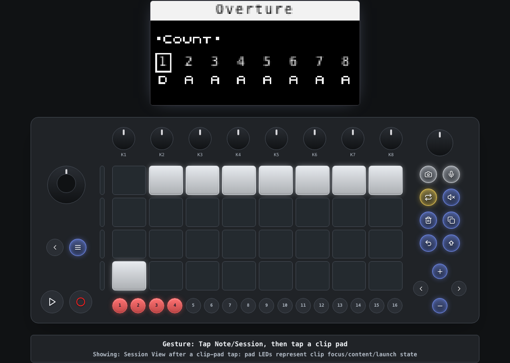

A clip pad changes the active clip or queues a launch depending on transport state and clip content.

### Return to detailed editing

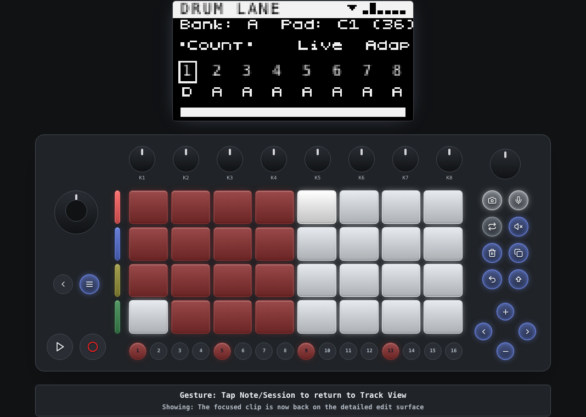

Back in Track View, the step row and parameter bank apply to the focused clip.

## Select Tracks

In Overture's Track View, the four side buttons select tracks 1-4. Hold Shift with a side button to reach tracks 5-8.

This is one of Overture's Move-native changes from dAVEBOx: side buttons are track identity first, not clip buttons.

### Side buttons select tracks

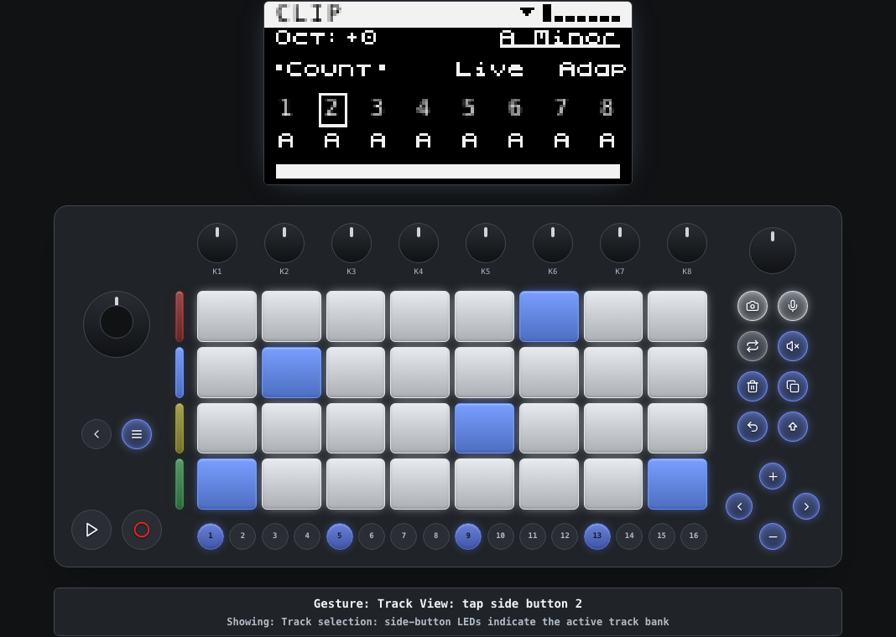

The active side-button LED shows the selected track. Other side buttons stay dim in their track colors.

### Shift reaches the upper track bank

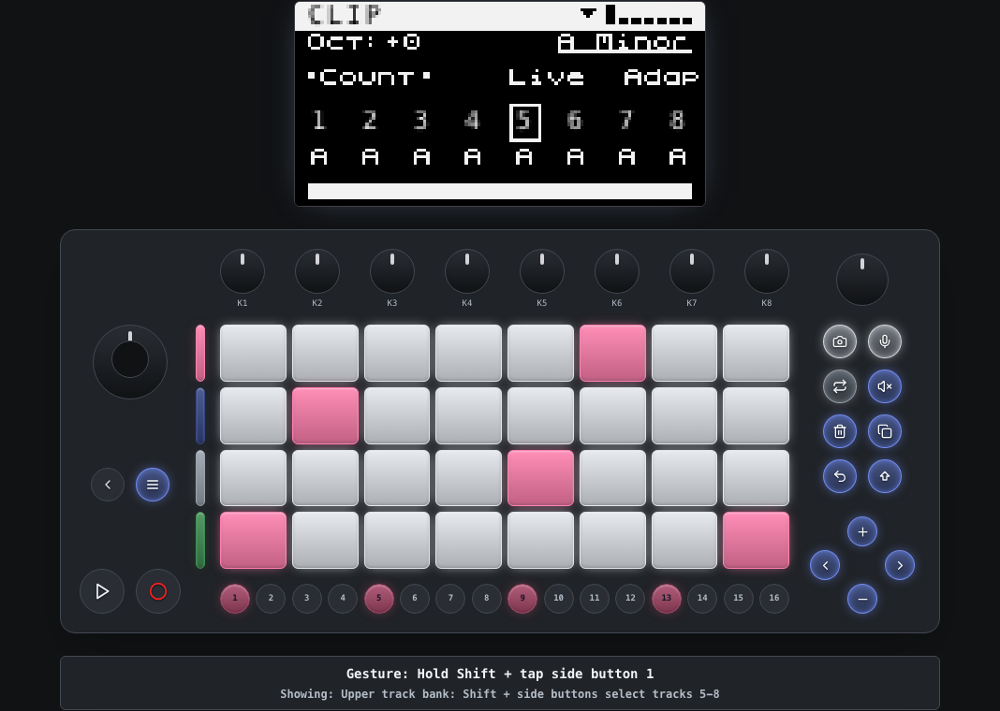

Hold Shift while selecting a side button to address tracks 5-8.

## Edit Parameters

Turn the jog wheel to move through parameter banks. Turn K1-K8 to change values in the visible bank.

Most values are clip-specific, so switching clips can change what the same controls do and what values they show.

### Parameter bank editing

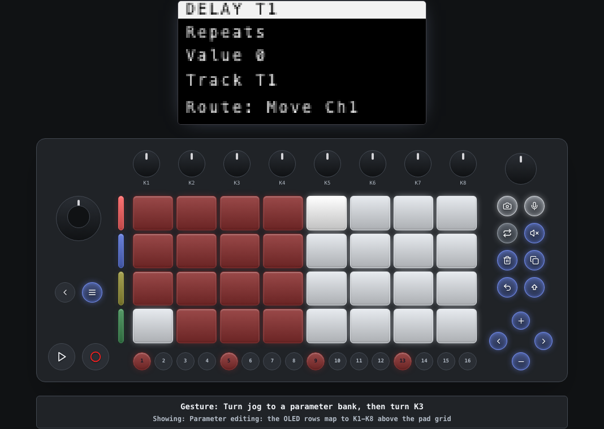

The OLED shows the active bank and the eight encoder rows. Touching or turning an encoder updates the corresponding value.

## Save and Export Entry Points

The Global Menu contains track configuration plus project-level actions. Open it with Shift + Note/Session, rotate the jog to move, and press the jog to edit or confirm.

This v1 guide only shows the entry points. It does not execute destructive or file-producing actions such as clearing a session or exporting.

### Open the Global Menu

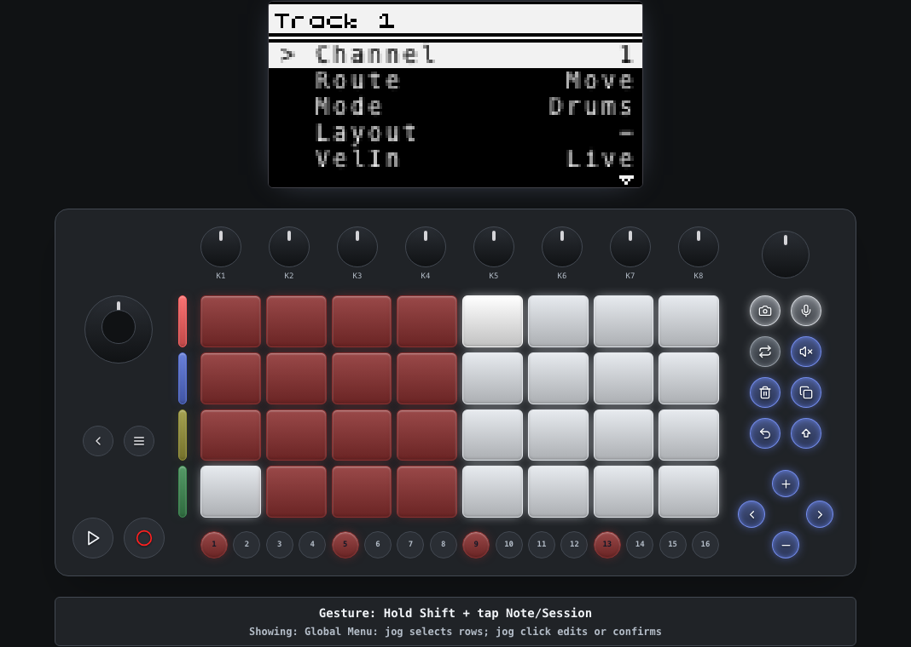

Shift + Note/Session opens the menu. The first pages are usually focused on the active track.

### Scroll to project actions

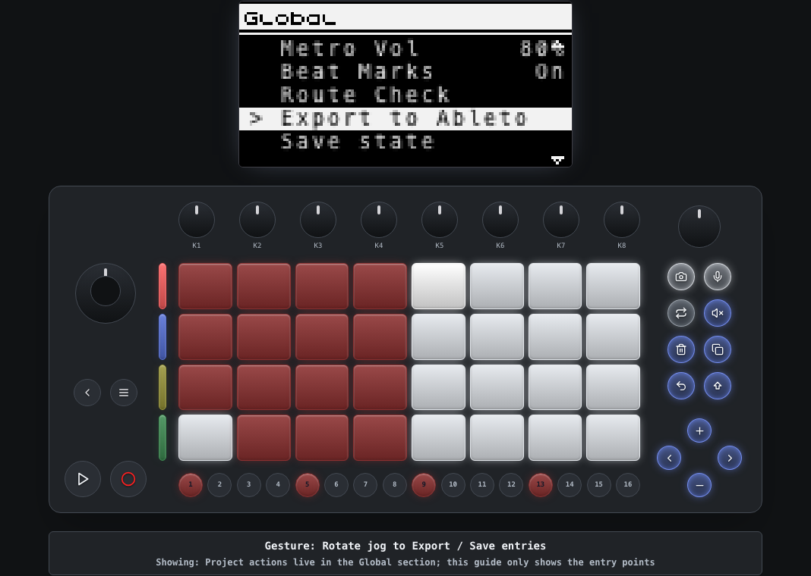

Rotate the jog to reach additional actions such as save, load, export, and global settings.
