# Overture Reference Manual

<!-- Generated by `pnpm -C web reference:generate`. Edit web/tests/manual/reference.ts (walkthrough) and reference-content.ts (intro, cheat-sheet, glossary). -->

This is the complete Overture reference: a screenshot-driven tour of every surface — the two views, track and clip selection, step and chord entry, step editing, the parameter banks, effects, automation, drums, scenes, performance, and the global menu. Each figure is produced by the real Overture UI running in the browser emulator, driven through the same MIDI gestures the hardware sends, so the manual always reflects the current build.

Read it top to bottom to learn the instrument, or jump via the contents. A cyan outline with a numbered badge marks each control you press for an action; the numbers match the legend on the action banner. Coloured button and pad fills are Overture's own live LED state. The OLED is always the source of truth — it names the current mode, track, and parameter bank.

Three things live only on real hardware and are noted where they appear: Move's tracks 1–4 sound editing (the firmware owns those voices), the final step of Bake/Export (it writes files through the host), and automation *playback* emission (the edit surface is shown here; emission is verified on device).

**Where to go deeper:** [Overture vs dAVEBOx](../OVERTURE-VS-DAVEBOX.md) — what this fork changes vs upstream, and why

## Contents

- [Controls cheat-sheet](#controls-cheat-sheet)
- [The Control Surface](#the-control-surface)
- [The Two Views](#the-two-views)
- [Selecting Tracks](#selecting-tracks)
- [Switching Clips](#switching-clips)
- [A First Drum Pattern](#a-first-drum-pattern)
- [Step Entry and Chords](#step-entry-and-chords)
- [Step Edit](#step-edit)
- [Per-Step Length on the Jog](#per-step-length-on-the-jog)
- [Parameter Banks](#parameter-banks)
- [Effects Banks](#effects-banks)
- [Automation](#automation)
- [Launching and Arranging Clips](#launching-and-arranging-clips)
- [Copy, Cut, and Delete Clips](#copy-cut-and-delete-clips)
- [Recording and Transport](#recording-and-transport)
- [Pages, Octave, and Performance](#pages-octave-and-performance)
- [The Global Menu](#the-global-menu)
- [Glossary](#glossary)

## Controls cheat-sheet

| Control | Gesture | What it does |
| --- | --- | --- |
| Note/Session | Tap | Toggle Track View and Session View |
| Side buttons 1-4 | Tap (Track View) | Select track 1-4 — hold Shift for 5-8 |
| Side button | Hold (Track View) | Reveal that track's 16 clips on the step buttons |
| Side buttons | Tap (Session View) | Launch the scene row (Shift = launch at next bar) |
| Pads | Tap | Play notes; pick a drum lane on drum tracks; launch clips in Session View |
| Pads | Hold several + Step | Enter a chord on that step |
| Step 1-16 | Tap | Place or clear a hit on the active lane/clip |
| Step 1-16 | Hold | Open Step Edit for that step |
| Step + Jog | Hold + turn | Adjust that step's length (Overture) |
| Shift + Step | Hold + tap | Per-step shortcuts |
| Jog wheel | Turn | Move through parameter banks |
| K1-K8 | Turn | Edit the eight values in the visible bank |
| Copy + pads | Hold + tap src, then dst (Session) | Copy a clip — keep Copy held through both taps (Shift = cut) |
| Delete + pad | Hold + tap (Session) | Clear a clip's notes (Shift = hard-reset) |
| ‹ › | Tap | Page through the clip / loop view |
| Octave +/- | Tap | Shift the pad octave / transpose |
| Record | Tap | Arm a one-bar count-in, then records automatically — no Play press (tap again to stop) |
| Play | Tap | Start / stop the transport |
| Loop | Tap / hold | Performance-mode latch |
| Shift + Note/Session | Hold + tap | Open the Global Menu (save, load, export, settings) |

## The Control Surface

Overture mirrors the Move control surface: the OLED on the left, eight encoders (K1-K8) across the top, a 4x8 pad grid, the Note/Session and Back buttons left of the pads, the step buttons along the bottom, four track side buttons, and the right-hand button cluster (Capture, Loop, Delete, Copy, Undo, Shift, transport).

The OLED is always the source of truth. It names the current mode, the track or pad in focus, and the active parameter bank — refer back to it whenever a control's effect isn't obvious.

### The Overture surface

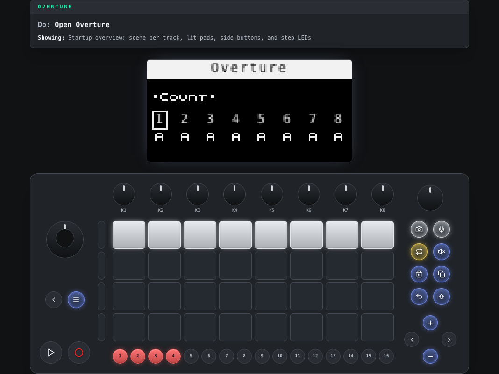

The full panel. Encoders top, pad grid centre, step buttons bottom, track side buttons right of the grid, transport and modifiers in the right cluster. The OLED names the current mode and bank.

### Reading the OLED

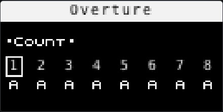

The OLED up close. Full-panel figures show it small, so refer back here: it always names the mode, the focused track/pad, and the active bank.

## The Two Views

Overture alternates between Track View — editing one clip in detail — and Session View — launching and arranging clips across tracks. Tap Note/Session to switch; it is a pure toggle.

Arrangement lives in Session View; detailed note and parameter editing lives in Track View. Almost everything in this manual is one or the other.

### Track View

Track View is the detailed editor: pads play notes or drum lanes, the step row edits the active clip, the jog moves through parameter banks, and K1-K8 edit the visible bank.

### Session View

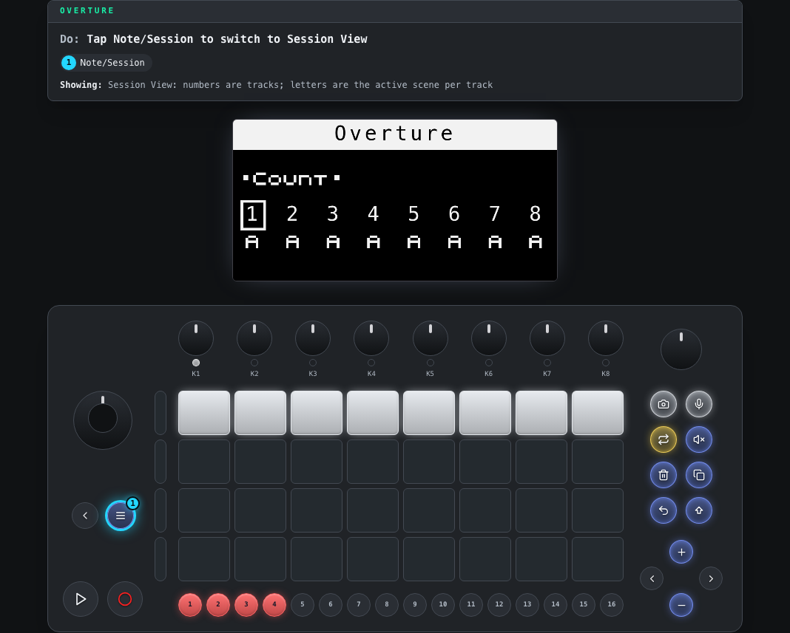

Session View is the clip launcher: the pad grid represents clips across tracks and scene rows.

## Selecting Tracks

In Track View the four side buttons select tracks 1-4 (this is Overture's Move-native change — side buttons are track identity first, not clip buttons). The active button glows in the track colour; the others stay dim.

Hold Shift while tapping a side button to reach the upper bank, tracks 5-8. Shift + jog and Shift + bottom-row pad also switch tracks, as fallbacks.

### Side buttons select tracks

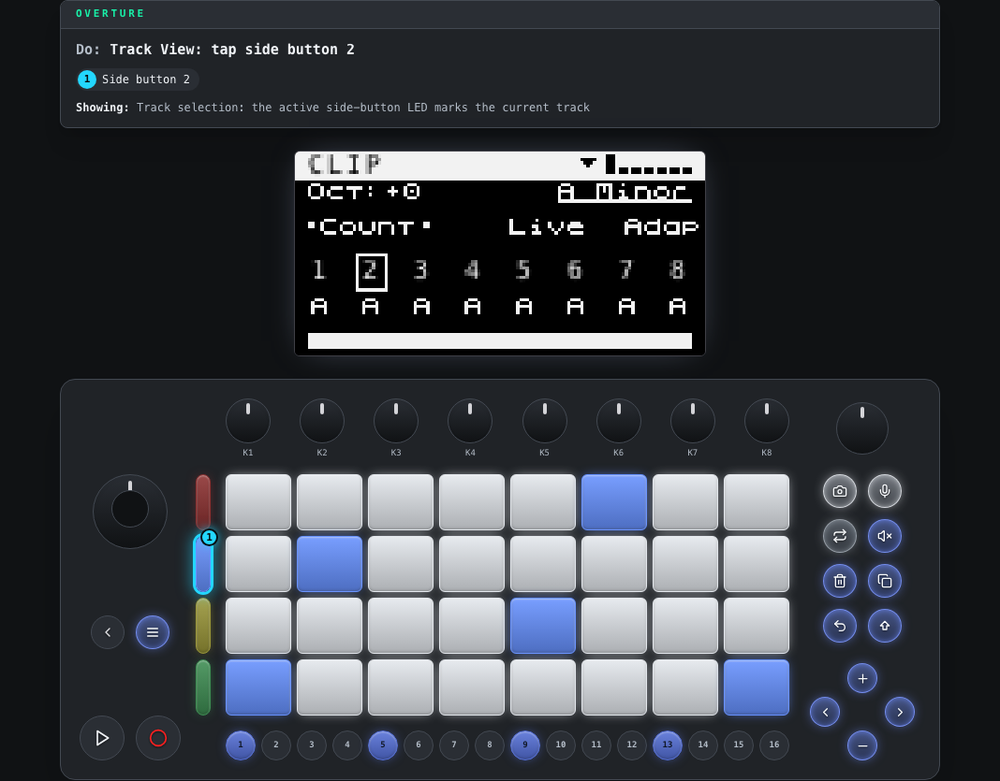

Tapping the second side button selects track 2. The active button lights in the track colour; the rest stay dim.

### Shift reaches tracks 5-8

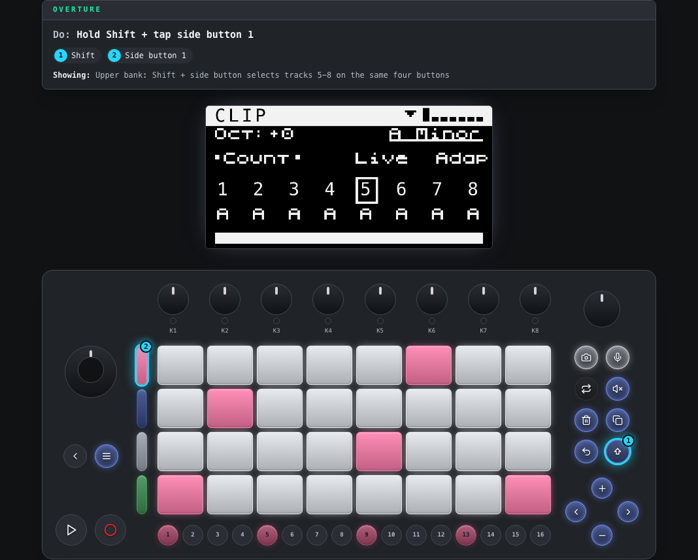

Hold Shift and tap the first side button to select track 5. The four side buttons address 1-4 normally and 5-8 under Shift.

## Switching Clips

Clips no longer live on the side buttons. To switch a track's active clip, hold that track's side button: its 16 clips appear on the step buttons — the active clip solid, playing clips flashing, clips with content dim, empty clips dark.

Tap a step to select or launch that clip, then release the side button to return to the step pattern. A quick tap (released before the overlay appears) just selects the track.

### Hold a side button to reveal clips

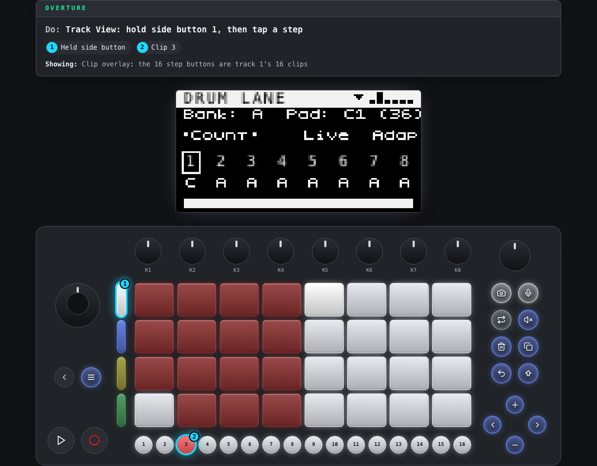

Holding the side button turns the step row into track 1's 16 clips; tapping step 3 selects/launches clip 3. Release the button to return to the pattern.

## A First Drum Pattern

On a drum track the left side of the pad grid selects drum lanes. With a lane active, the sixteen step buttons place hits for that lane.

This is the fastest way to make Overture feel concrete: pick a lane, place a few steps, then press Play.

### A simple lane pattern

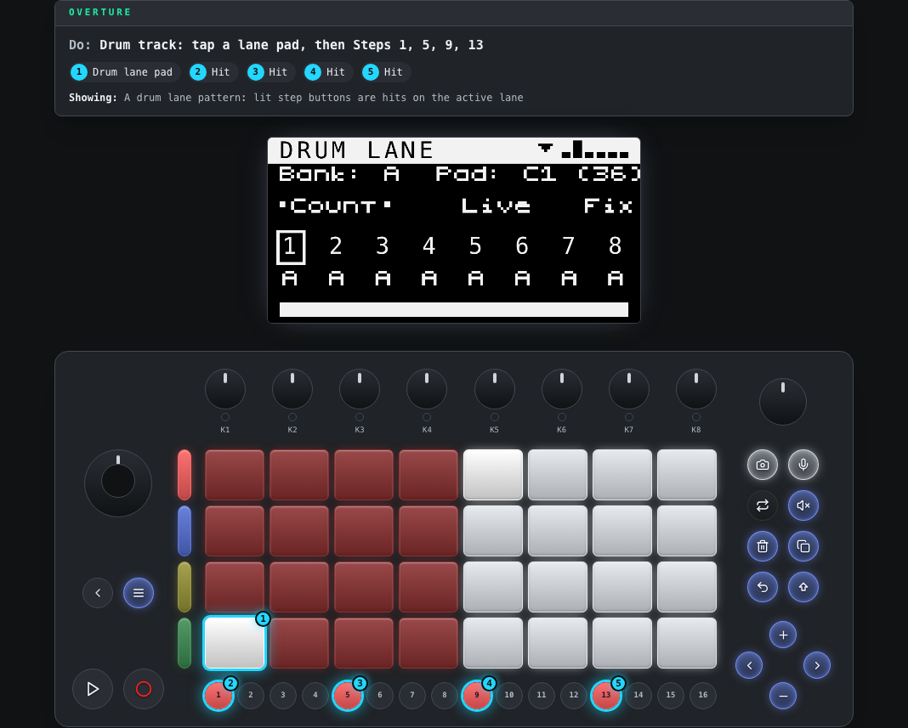

Four lit steps are a four-on-the-floor hit pattern on the active drum lane. The OLED stays the source of truth for the current lane and edit context.

## Step Entry and Chords

On a melodic track, tap the step buttons to place notes on the active clip; the pads play and audition pitches. New melodic steps default to a full step length (Move's keys presets are voiced for sustained notes); new drum steps stay at a tight half step.

To enter a chord, hold several pads together and tap a step — every held pitch is written to that step.

### Chord entry

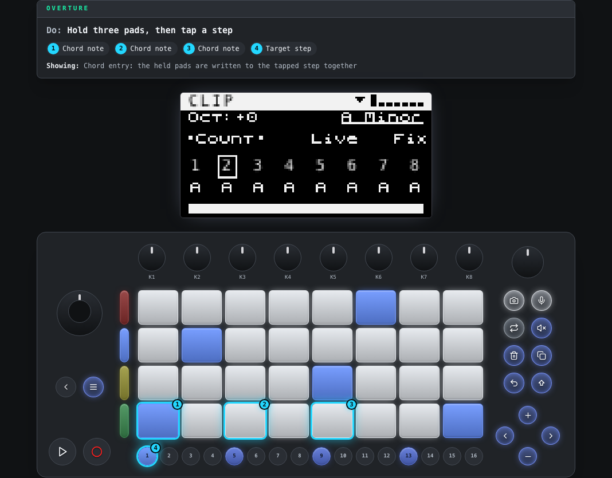

On a melodic track, holding pads 1, 3 and 5 and tapping step 1 writes all three pitches to that step as a chord.

## Step Edit

Hold a step to open Step Edit for that step. The OLED shows the step's per-note detail and the encoders edit it: length, velocity, micro-timing, and the trig conditions Iter (fire every Nth loop), Prob (fire by chance), and Ratch (retrigger within the step).

Release the step to return to the pattern. Step Edit is how a flat pattern becomes a living one.

### Hold a step to edit it

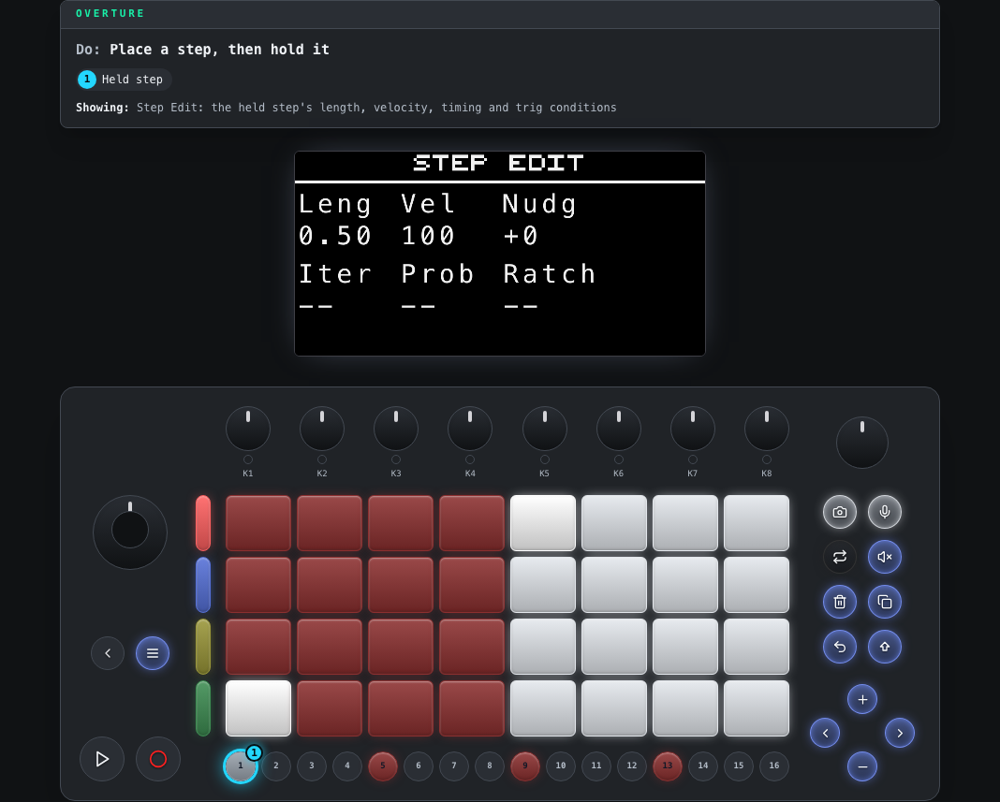

Holding a placed step opens Step Edit: the encoders now edit that one step. The trig conditions (Iter / Prob / Ratch) live here.

## Per-Step Length on the Jog

Hold a step and turn the jog wheel to adjust that step's length — Move's "hold step + wheel = length" gesture. On an empty step the jog does nothing.

This is an Overture change: in dAVEBOx, turning the jog while holding a step silently cycled the parameter banks underneath. The jog is now reserved for step length during a hold and never changes banks.

### Hold step + jog = length

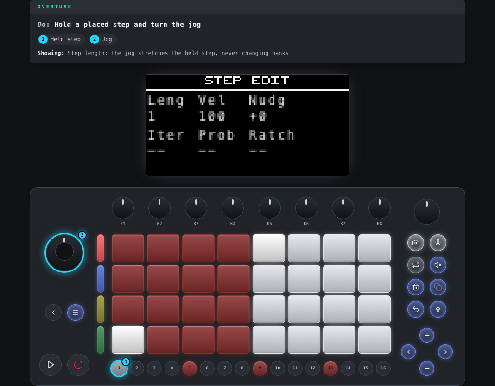

With the step held, the jog adjusts its length. Releasing the step returns to the pattern with the parameter bank unchanged.

## Parameter Banks

Turn the jog to move through the parameter banks for the active clip; the Track-View header shows a bank-position strip — a tick per bank with the active one as a tall block — so you can see how many banks exist and where you are. Turn K1-K8 to edit the eight values in the visible bank.

On a melodic track the banks in order are CLIP, NOTE FX, HARMONY, DELAY, SEQ ARP, ARP IN, and AUTO; a drum track swaps in DRUM LANE, ALL LANES and REPEAT GROOVE. Most values are clip-specific, so switching clips can change what the same controls do.

### Bank editing

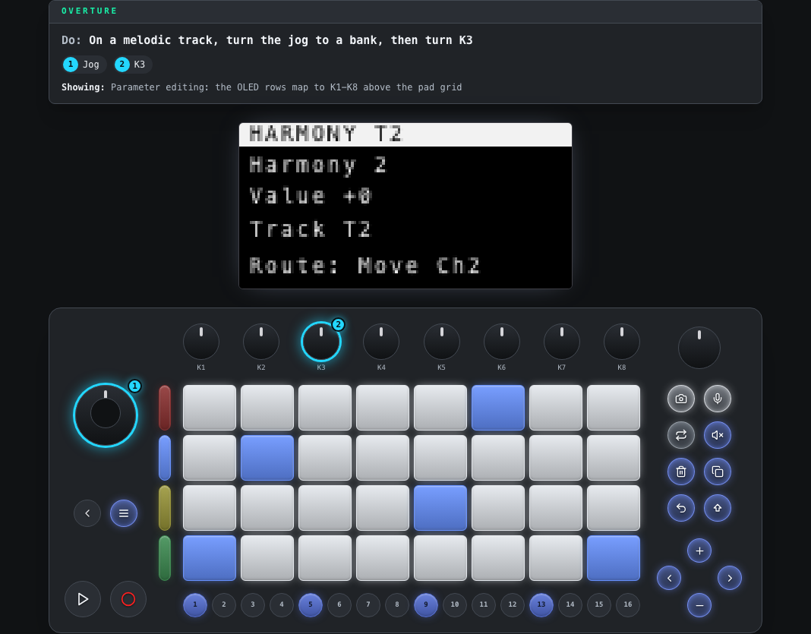

The OLED shows the active bank (here HARMONY) and its eight encoder rows. Turning an encoder updates the matching value; the header strip marks the bank position.

### The bank readout up close

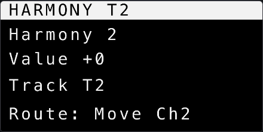

The OLED row order matches K1-K8 left to right — the close-up makes the active bank and its values legible.

## Effects Banks

Several parameter banks are effects that process the track's notes before they leave Overture: NOTE FX (per-note transforms and gating), HARMONY (added intervals, melodic only), DELAY (tempo-synced echoes), and the arpeggiators SEQ ARP and ARP IN.

They are reached the same way as any bank — turn the jog — and edited on K1-K8. Overture generates no audio itself; these shape the MIDI sent to Move's instruments or an external synth.

### An effects bank

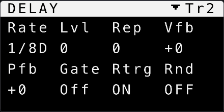

Stepping the jog past CLIP reaches the effects banks (here DELAY). Each is eight encoder values; the OLED names the bank so you always know which effect you're editing.

## Automation

The AUTO bank records parameter automation as per-step CC lanes (p-locks): pick a target with the encoders and the value is stored per step, so a sweep or a moving filter rides with the clip.

The edit surface is shown here. Automation *playback* — the recorded CCs being emitted as the clip plays — is verified on the device; the emulator models the edit, not the live emission.

### The AUTO bank

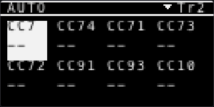

AUTO records per-step parameter values that ride with the clip. (Device-only: the recorded CCs emit during playback on hardware — the emulator shows the edit surface, not the live emission.)

## Launching and Arranging Clips

In Session View the pad grid is clips: columns are tracks, rows are scenes. Tap a clip pad to launch it; tap the side buttons to launch a whole scene row (Shift + side launches at the next bar boundary).

This is where you arrange — building scenes and moving between them — while Track View stays focused on editing the selected clip.

### Launch a clip

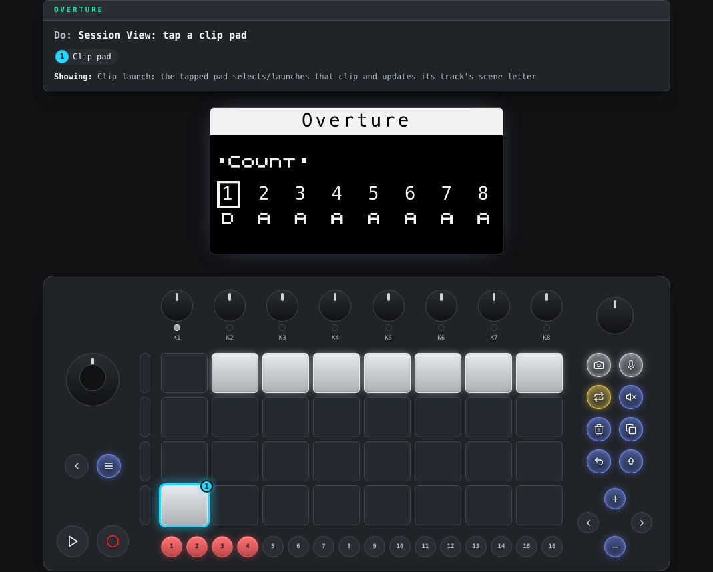

Tapping a clip pad launches that clip on its track; the OLED's track scene letter updates to match.

## Copy, Cut, and Delete Clips

Per-clip operations live in Session View, on the clip pads (where Move keeps clip management). To copy a clip, hold Copy and tap the source clip — the OLED shows COPIED — then, still holding Copy, tap the destination clip to paste it. Releasing Copy forgets the source, so keep it held across both taps.

Shift + Copy cuts instead of copies; Delete + a pad clears its notes; Shift + Delete hard-resets the clip (notes and all parameters). Drum clips copy and cut the same way, carrying all 32 lanes. In Overture these moved off the Track-View side buttons (which now select tracks) to here.

### Copy a clip

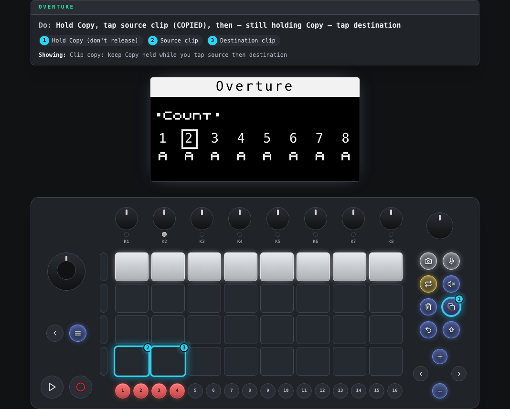

Hold Copy, tap a source clip (the OLED shows COPIED), then — without releasing Copy — tap the destination to paste. Release Copy and the source is forgotten. Delete + pad clears a clip; add Shift to cut or hard-reset.

## Recording and Transport

With the transport stopped, tap Record: a one-bar count-in leads in over the metronome, then the transport starts and recording begins on its own — you do not press Play. Your pad and MIDI input is captured into the active clip in real time, quantised to the clip's grid. Tap Record again to stop.

Live recording captures what step entry can't — feel and timing — and lands on the same steps you'd otherwise place by hand. (If the transport is already running, Record arms straight into capture with no count-in.)

### Arm recording

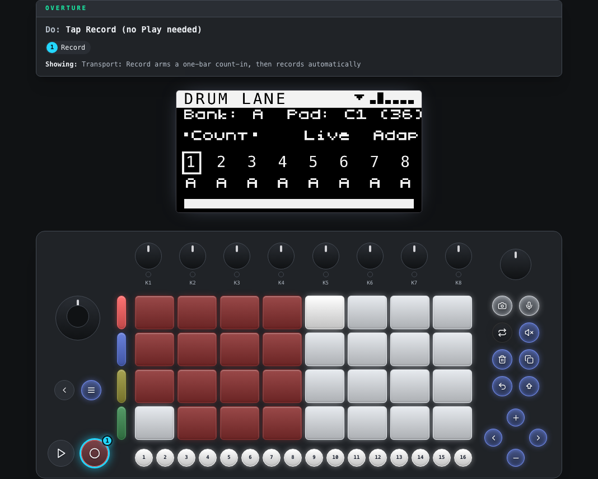

Tapping Record arms a one-bar count-in (metronome on); the transport and recording then start by themselves — no Play press. Tap Record again to stop. (Count-in and capture timing are verified on the device.)

## Pages, Octave, and Performance

The ‹ › buttons page through a clip longer than 16 steps (and the loop view); Octave +/- shift the pad octave on melodic tracks (and transpose with Shift). The Loop button latches Performance mode — a live layer for momentary loops and repeats over the playing pattern.

These are the live-playing controls: move around a long clip, reach the octave you want, and perform on top without disturbing the stored pattern.

### Page through a clip

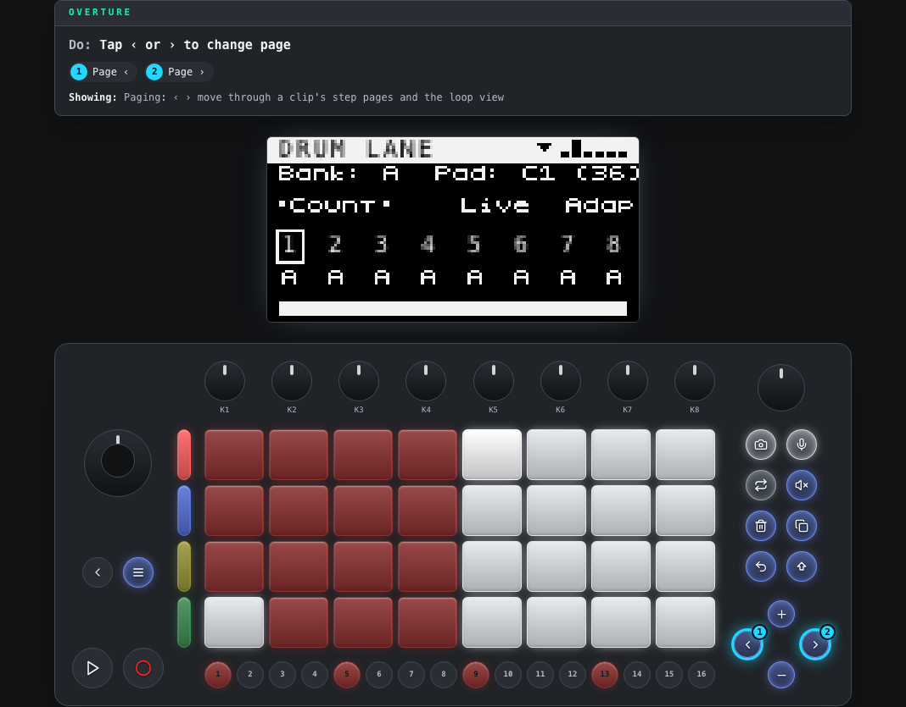

‹ › page through a long clip's steps. Octave +/- shift the pad octave; the Loop button latches Performance mode for live loops over the pattern.

## The Global Menu

Hold Shift and tap Note/Session to open the Global Menu: track configuration plus project actions. Turn the jog to move the selection, press the jog to edit or confirm an item, and Back to leave.

Track config (channel, route, pad mode, key/scale) and project actions (save, load, export, settings) all live here.

### Open the Global Menu

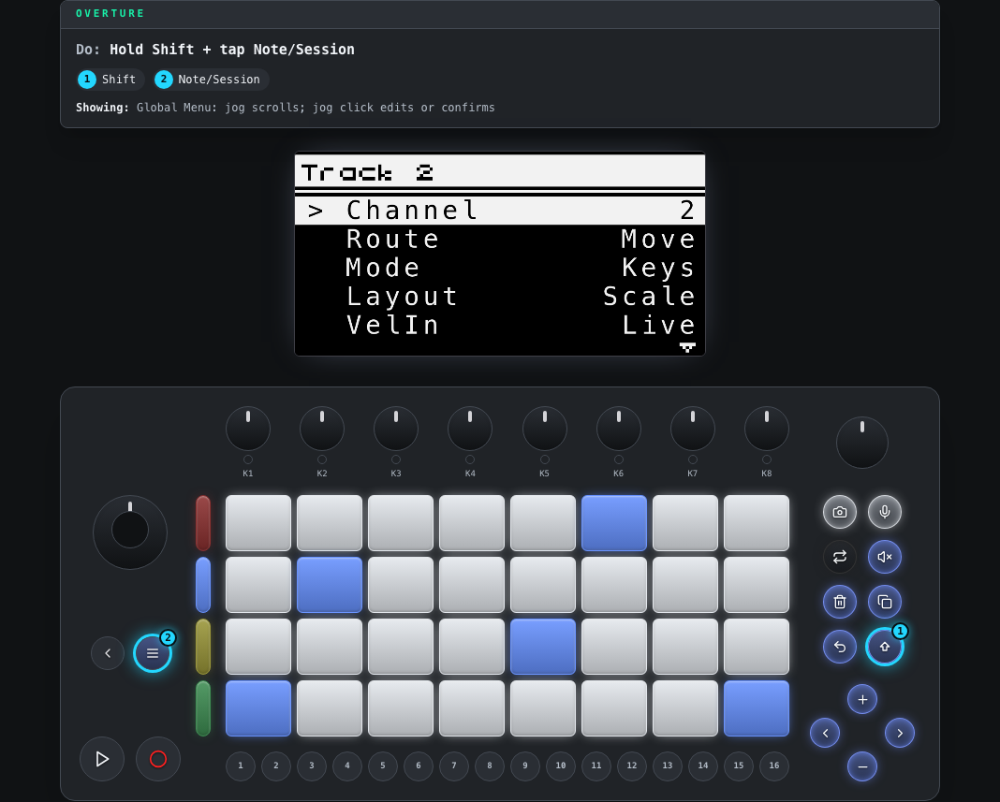

Shift + Note/Session opens the menu. Turn the jog to move, press the jog to edit or confirm. The first pages focus on the active track.

### Project actions

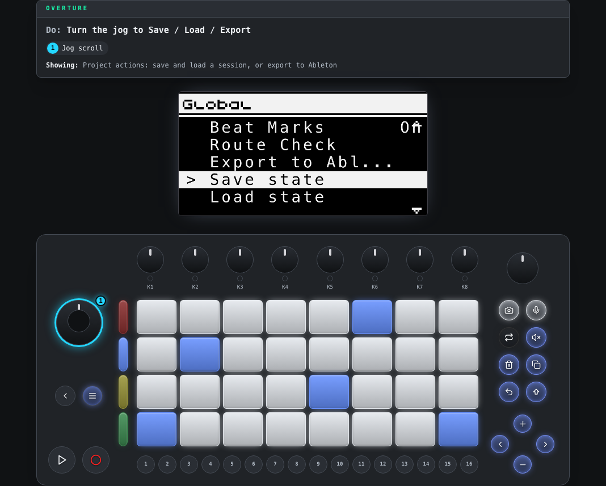

Scrolling the jog reaches the project actions: save, load, export, and global settings. (Device-only: Export's final write to an Ableton Set happens through the host on hardware.)

## Glossary

| Term | Meaning |
| --- | --- |
| Track View | The detailed editor for one clip: pads, steps, jog, and encoders. |
| Session View | The clip launcher: the pad grid is clips across tracks and scene rows. |
| Scene | A row of clips — one per track — launched together (A, B, C ...). |
| Clip | One pattern on a track. Each track holds 16 clips; the active clip is what Track View edits. |
| Parameter bank | A page of eight encoder (K1-K8) parameters shown on the OLED (CLIP, NOTE FX, HARMONY, DELAY, SEQ ARP, ARP IN, AUTO). |
| Drum lane | One drum voice on a drum track; its 16 steps are edited on the step row. 32 lanes per drum track. |
| Step Edit | The per-step editor opened by holding a step: length, velocity, micro-timing, and trig conditions. |
| Trig condition | A per-step rule — Iter (every Nth loop), Prob (chance), Ratch (retrigger) — that varies when a step fires. |
| Performance mode | A Loop-latched live layer for momentary loops and repeats over the playing pattern. |
| Bank-position strip | The Track-View header tick strip showing how many banks exist and where the jog is (Overture). |

---

[Overture vs dAVEBOx](../OVERTURE-VS-DAVEBOX.md) — what this fork changes vs upstream, and why
